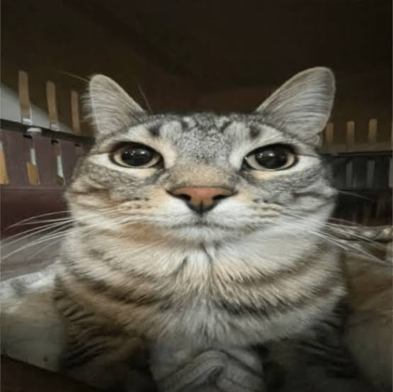

# Real-Time Cat Meme Mirror 🐱

An interactive computer vision project using Google MediaPipe and OpenCV that tracks your facial expressions and hand gestures in real-time, matching them side-by-side with iconic cat memes.

<p align="center">
  
</p>

## Features
- Real-time facial landmark tracking via MediaPipe Face Mesh (468 points).
- Gesture detection via MediaPipe Hands.
- Heuristic-based classification (Mouth Aspect Ratio, Eye Aspect Ratio, Smile Ratio).
- Debounced state transitions for jitter-free visual experience.

## Installation & Setup
```bash
# Clone the repository
git clone [https://github.com/kitalikedev/Cat-Meme-Mirror.git](https://github.com/kitalikedev/Cat-Meme-Mirror.git)
cd Cat-Meme-Mirror

# Install dependencies
pip install -r requirements.txt

# Run the app
python src/main.py